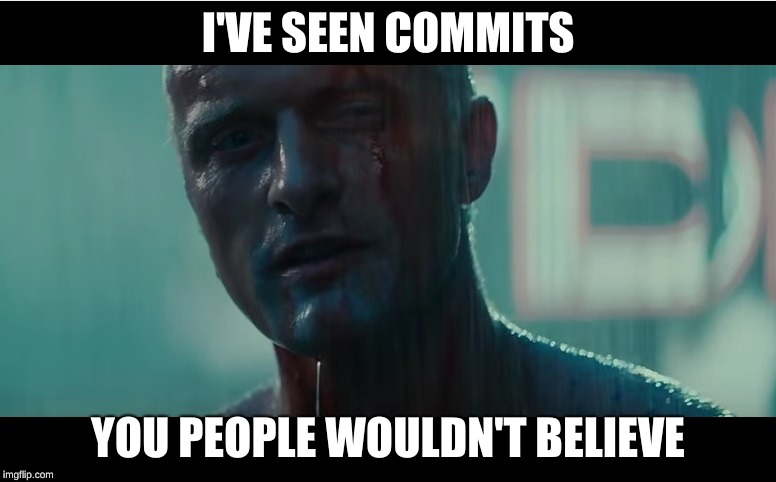
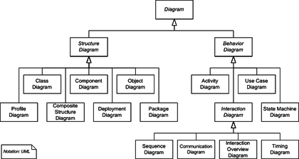
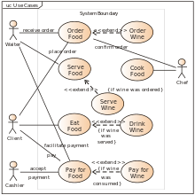
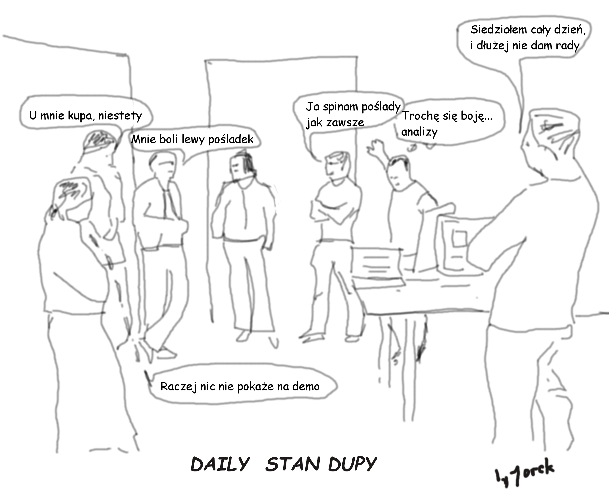
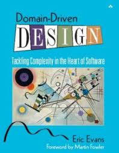
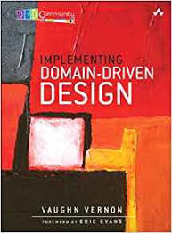
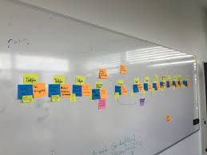
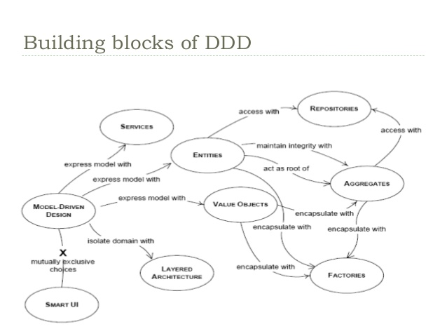
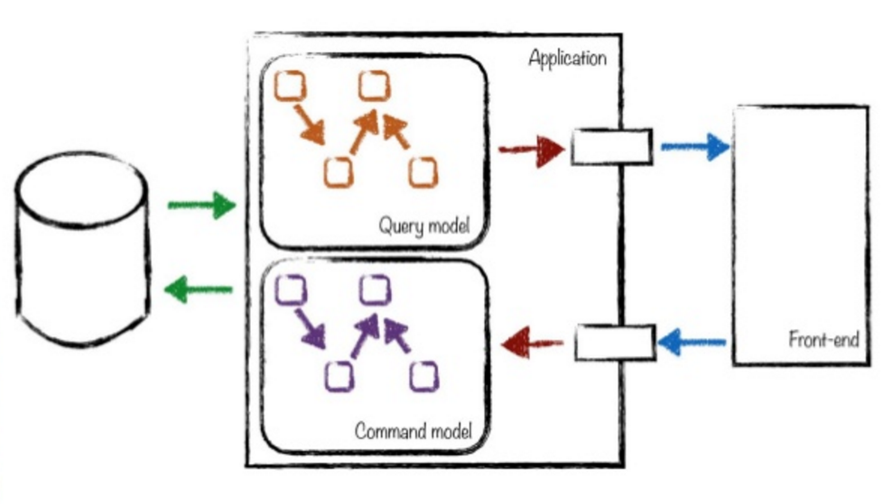

# Dysfunctional DDD


# Jarek

Wizard, Anarchitect, Coder

&gt; 25 years of coding<!-- .element class="fragment"-->





# disclaimer
   - I tried not to attack anyone personally, actually I do like my coleagues doing DDD, and I have learned a lot from some  of them<!-- .element class="fragment"-->
   - just not DDD<!-- .element class="fragment"--> `¯\_(ツ)_/¯`<!-- .element class="fragment"-->
   - not an expert, (some experience wih CQRS/ES not DDD)<!-- .element class="fragment"-->


# Why DDD?
- Object oriented world
- Obiect oriented design
- people talk about it 


- like UML
- like Agile




cool<!-- .element class="fragment"-->




What??<!-- .element class="fragment"-->


# Agile cool
 - Tests, TDD
 - CI,
 - Code over comments
 - contact with user


<!-- .element height="600px"-->


# Agile reality
 - boring meetings
 - agile coaches, 
 - certificates
 - agile tools
 - books
 - conferences
 - trainings
 - velocity :-)


 


There is nothing wrong about money.

I work for money!


But who likes marketing b...it?!


# Books

<!-- .element height="400px"-->
 <!-- .element height="400px"-->


DDD good parts
- researching community
- make systems better
- patterns


<!-- .element height="400px"-->


DDD bad(?) parts
- marketing
- example projects
- over-engineering 
- crazy wars
- hard to see the point


<!-- .element height="400px"-->


<!-- .element height="400px"-->


# BUT


# DDD


# Hard way


Skipping some essential parts. 

Like `bounded context` etc.

Actually there is some sense and real value in that.<!-- .element class="fragment"--> 


DDD is mostly not about `technology`


# Finding common Language

Ubiquitous Language


I just love to `code` more


And you wil not pay me for my fancy sport car anyhow :-(


# Lets play snake  (multiplayer)


# Commands


```haskell
data SnakeCommand
   = SetDirection { wantedDirection :: SnakeDirection }
   | MakeStep
   | Begin { 
             initName :: String
           , initCell :: SnakeCell }
```
We will need more of them later.


# Commands

 - user or subsytem `wants` to do something


# Events

```haskell
data SnakeEvent
   = DirectionChanged { newDirection :: SnakeDirection }
   | Killed
   | Born { bornName :: String
          , bornCell :: SnakeCell }
   deriving (Eq, Show, Generic)
```
 (more needed)


# Event

 - it has happened
 - no validation (it really happened)
 - a command may results in 0..n events 


*Funny fact*

You will not find anything about commands and events in Eric Evans book
 
Even though nowadays  DDD community seems to be all around those concepts 


# Event sourcing

What if just stored only events?


```
example

```

# Value Object

- immutable...
- represents value from real life (or not)
- has no identity
- properties define equality


```haskell
type SnekeId = String

type NickName  = Text

data SnakeDirection
   = SnakeUp
   | SnakeRight
   | SnakeDown
   | SnakeLeft
   
```


# Entity

- has identity
- in OOP may be mutable
- some ID defines equality 
- entity may contain `value objects`
- entity may contain `entities`


```haskell

data SnakeCell = SnakeCell
   { cellX :: Int
   , cellY :: Int
   } 

data SnakeState
   = Alive { direction :: SnakeDirection
           , cells     :: [SnakeCell]
           , maxLength :: Int }
   | Dead
   | Init

type SnakeEntity = (SnakeId, SnakeState)
```


Easy?


- SnakeCell(x,y) is value object or entity?


*funny fact*

Have never introduced SnakeEntity. 
Only have SnakeState  which does not (physically) contain Id


# Aggregate


Cluster of objects (entities, value objects)

Transactions never cross aggregates

Aggregate remains consistent


# Aggregate root

 - One root entity from Aggregate
 - outside world communicates with it (sends commands)
 - outside world only keeps reference to this `object`  


```haskell
class Aggregate s where
    data Error s :: *
    data Command s :: *
    data Event s :: *

    execute :: s -> Command s -> Either (Error s) (Event s)
    apply :: s -> Event s -> s
    seed :: s
```
Typeclass
source: https://gist.github.com/Fristi/7327904


```haskell
executeCommand :: SnakeData -> SnakeCommand -> [SnakeEvent]
executeCommand SnakeData {state = Alive {}} MakeStep = [StepMade]
executeCommand _ MakeStep = []
executeCommand SnakeData {state = Alive {direction = od}} SetDirection {wantedDirection = nd}
   | opposite = []
   | otherwise = [DirectionChanged {newDirection = nd}]
  where
    opposite = V.dirIs0 $ V.dirPlus newVec currentVec
    newVec = V.dirVector nd
    currentVec = V.dirVector od
executeCommand anySnake SetDirection {} = []
executeCommand SnakeData {state = Alive {}} Die = [Killed]
executeCommand _ Die = []
executeCommand SnakeData {state = Init} Begin {initName = d, initCell = c} = [Born {bornName = d, bornCell = c}]
executeCommand _ Begin {} = []
-- executeCommand snake@SnakeData{ state = alive@Alive{}} Eat {}= []
executeCommand _ Eat{} = []
```

Command handler


```haskell
applyEventX snake@(SnakeData {state = alive@Alive {}}) DirectionChanged { newDirection = nd }  =
      makeRes $ snake { state = alive{direction = nd} }
applyEventX snake@(SnakeData {state = Alive {}}) Killed = makeRes snake { state = Dead}
applyEventX SnakeData {state = Init} Born {bornName = nm, bornCell = cell} = SnakeEventResult {
            newSnake = SnakeData { name = nm , state = initialState },
               newCells = [cell], removedCells = []
      }
   where initialState = Alive { direction = SnakeUp, cells = [cell], maxLength = 5 }
applyEventX snake@(SnakeData {state = alive@Alive {maxLength = n}})  HasEaten{} =
         makeRes snake { state = alive { maxLength = n+3} }
applyEventX _ _ = error "todo"

```

Event handler


Modelling with events, commands is not needed in DDD. 
It was not even defined in original book. 
I just found that concentrating on behaviour brings more value.


Event storming


# Repository


Remember DAO?


Magic...


- loadEntity::Id->IO Entity
- saveEntity::Id->Entity->IO ()  
- etc...


*Fact*
Lots of magic Java frameworks trace state of objects
and automatically persist changes to database.
This means that a sensible repository save method looks like:


```java
   void save(MyObject t) {
    
   }
```


But what in case of event sourcing?


```haskell
data SnakeAggregate = SnakeAggregate { 
      state :: SnakeState,
      uncommittedEvents :: [SnakeEvent]
}       
```


Common pattern in DDD style event sourcing is to save those `uncommited events`


I find it unnatural


 I started to send commands to a *Repository*


# CQS

Command Query separation


If you ask (Query) do not change the state


If You change state (Command) do not expect result


A Stack

```java
void stack.push( T  t);
T  stack.pop();
```


A CQS Stack

```java
void stack.push( T  t);
T stack.top();
void stack.pop();
```


Simple?


what if called on empty stack?
```
void stack.pop();  // boom
```


OO world consensus:

commands may return exceptions, some status


Is `error` not a result?


In FP world


```haskell
push::Stack a->a->Stack a
top::Stack a->a
pop::Stack a->Stack a 
```


In FP world each operation gives a result


IO ()


```haskell
whatAPop::Stack a->(Stack a, a)
```

Is it really bad?


Actually I do not see much sense in classical CQS

 - nice to have separated queries
 - Error/Exception **is** an result
 - It only makes API easier to use ... in some mediocre languages
 - if we are thinking about `async`?


 ```
 push::Stack a -> MonadAsync (Stack a)
```


 # CQRS
 
Command Query Response Segregation


CQRS   ~ CQS on a higher level


Write/Command model - Aggregates


Read/Query model - Projections





```haskell
data PlaneState = PlaneState
   { allSnakes :: Repo.SnakesMap
   , allCells  :: CellsMap
   , changes :: Changes
   } deriving (Show, Generic)
```

My game field projection.


Used by browser

Used to detect collisions (???)


 
 ## Books
 nothing about cqrs 
 
 ## Resources
 - nabrdalik
 - vlingo

## 


# Test 2
