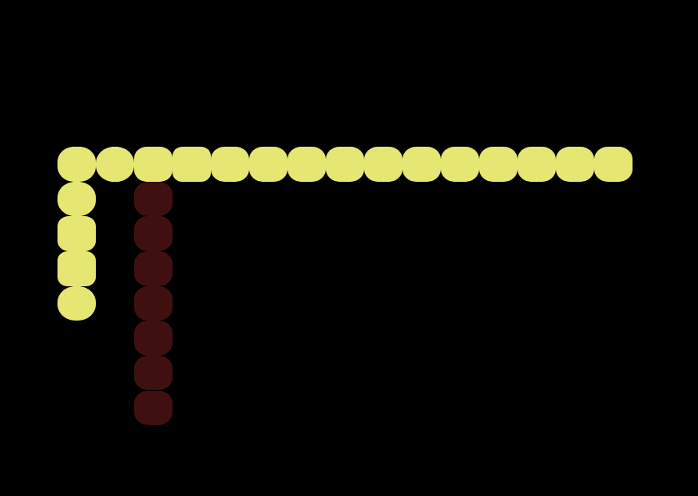
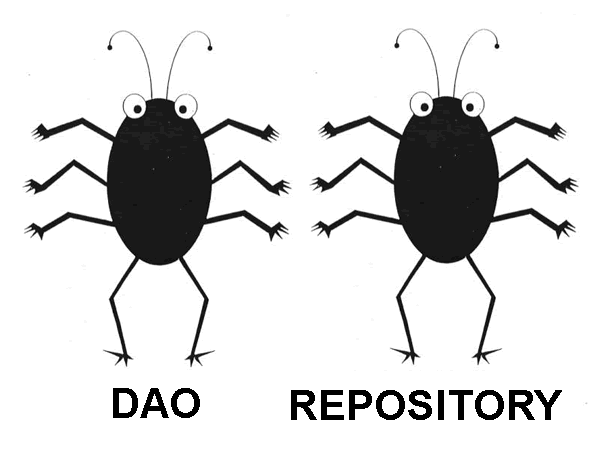

# Dysfunctional DDD


# Jarek

Wizard, Anarchitect, Coder

&gt; 25 years of coding<!-- .element class="fragment"-->


# disclaimer
   - I tried not to attack anyone personally, actually I do like my colleagues doing DDD, and I have learned a lot from some  of them<!-- .element class="fragment"-->
   - not an expert, (some experience wih CQRS/ES not DDD)<!-- .element class="fragment"-->


# Why DDD?
- People talk about it
- Object oriented world
- Like mixing concepts 


My problem with DDD


DDD story resembles me 
- UML
- what happened to  Agile


<!-- .element height="400px"-->

cool<!-- .element class="fragment"-->


<!-- .element height="400px"-->

What??<!-- .element class="fragment"-->


# Agile cool
 - Tests, TDD
 - CI,
 - Code over comments
 - contact with user


<!-- .element height="600px"-->


# Agile reality
 - boring meetings
 - agile coaches, 
 - certificates
 - agile tools
 - books
 - conferences
 - trainings
 - velocity :-)


 


There is nothing wrong about money.

I work for money!


But who likes marketing b...it?!


For years I was scared of DDD marketing


# Books

<!-- .element height="400px"-->
 <!-- .element height="400px"-->


Make logic of the system visible in code


# DDD good parts
- community
- constant improvement
- lots of patterns / ideas
- interesting stories


<!-- .element height="400px"-->


DDD bad(?) parts
- marketing
- example projects
- over-engineering 
- partly toxic community
- hard to see the point


If a tool, methodology, framework makes simple case **complex**

it will probably not make a real life, complex project **simple**  


<!-- .element height="400px"-->


<!-- .element height="400px"-->


# BUT


# DDD


# Hard way


Skipping some essential parts. 

Like `bounded context` etc.


DDD is mostly not about `technology`


# Finding common Language

Ubiquitous Language


Some concepts are useful, but have nothing to do with FP 


I just love to `code` more


And you wil not pay me areal money (for a fancy car) :-(


# Lets play snake  (multiplayer)





# Commands


```haskell
data SnakeCommand
   = SetDirection { wantedDirection :: SnakeDirection }
   | MakeStep
   | Begin { 
             initName :: String
           , initCell :: SnakeCell }
```


# Commands

 - user or subsytem `wants` to do something
 - commands may be associated with validation


# Events

```haskell
data SnakeEvent
   = DirectionChanged { newDirection :: SnakeDirection }
   | StepMade
   | Killed
   | Born { bornName :: String
          , bornCell :: SnakeCell }
   deriving (Eq, Show, Generic)
```


# Event

 - it has happened
 - no validation (it really happened)
 - a single command is associated in 0..n events 


*Fact*

You will not find anything about this  in Eric Evans book  (blue))
 
Even though nowadays  DDD community seems to be all around those concepts 


# Event sourcing

What if just stored only events?


```json
[
  {
    "event": {
      "tag": "Born",
      "bornName": "aa",
      "bornCell": {
        "cellY": 18,
        "cellX": 14
      }
    },
    "snakeId": "4d09ac06-0375-4cb0-ad08-c70d14968677"
  },
  {
    "event": {
      "tag": "DirectionChanged",
      "newDirection": "SnakeRight"
    },
    "snakeId": "d305e9da-10a2-4fa6-af7e-16443ad5856b"
  },
 

```


# Command sourcing?

Also possible... but in fact harder - validation is a problem


# Value Object

- immutable...
- represents value (from `real` life)
- has no identity
- properties define equality


```haskell
type SnekeId = String

type NickName  = Text

data SnakeDirection
   = SnakeUp
   | SnakeRight
   | SnakeDown
   | SnakeLeft
   
```


# Entity

- has identity
- in OOP may be mutable
- ID defines equality 
- entity may contain `value objects`
- entity may contain `entities`


```haskell

data SnakeCell = SnakeCell
   { cellX :: Int
   , cellY :: Int
   } 

data SnakeState
   = Alive { direction :: SnakeDirection
           , cells     :: [SnakeCell]
           , maxLength :: Int }
   | Dead
   | Init
   
data Snake = Snake
   { name  :: String
   , state :: SnakeState
   } deriving (Eq, Show, Generic)

type SnakeEntity = (SnakeId, Snake)
```


Easy?


- `SnakeCell(x,y)` is value object or entity?


*To think*

I have never introduced `type SnakeEntity = (SnakeId, Snake)` 

Only have SnakeState which does not (physically) contain Id

an Entity without id??<!-- .element class="fragment"-->


Some DDD concepts may not be explicitly  existing in code
 
`(SnakeId, Snake)`


It gets worse


# Aggregate


Cluster of objects (entities, value objects, + ) 


Aggregate remains consistent


Keeps invariants


Transactions should not cross aggregates


# Aggregate root

- Selected entity from Aggregate (root)
- outside world communicates with it (sends commands)
- outside world only keeps reference to this `root object`  
- command handler
- event handler


```haskell
class Aggregate s where
    data Error s :: *
    data Command s :: *
    data Event s :: *

    execute :: s -> Command s -> Either (Error s) (Event s)
    apply :: s -> Event s -> s
    seed :: s
```
Typeclass
source: https://gist.github.com/Fristi/7327904


# Command handler

```haskell
executeCommand :: Snake -> SnakeCommand -> [SnakeEvent]
```


# Better command handler
```haskell
executeCommand :: Snake -> SnakeCommand
      -> Either MyError [SnakeEvent]
```


# Event handler
```haskell
applyEvent::Snake-> SnakeEvent -> Snake
```


# Summary
- define commands
- define events
- select root Entity
- define commands handler
- define events handler


```haskell
executeCommand :: SnakeData -> SnakeCommand -> [SnakeEvent]
executeCommand SnakeData {state = Alive {}} MakeStep = [StepMade]
executeCommand _ MakeStep = []
executeCommand SnakeData {state = Alive {direction = od}} SetDirection {wantedDirection = nd}
   | opposite = []
   | otherwise = [DirectionChanged {newDirection = nd}]
  where
    opposite = V.dirIs0 $ V.dirPlus newVec currentVec
    newVec = V.dirVector nd
    currentVec = V.dirVector od
executeCommand anySnake SetDirection {} = []
executeCommand SnakeData {state = Alive {}} Die = [Killed]
executeCommand _ Die = []
executeCommand SnakeData {state = Init} Begin {initName = d, initCell = c} = [Born {bornName = d, bornCell = c}]
executeCommand _ Begin {} = []
-- executeCommand snake@SnakeData{ state = alive@Alive{}} Eat {}= []
executeCommand _ Eat{} = []
```

Real Command handler


```haskell
applyEventX snake@(SnakeData {state = alive@Alive {}}) DirectionChanged { newDirection = nd }  =
      makeRes $ snake { state = alive{direction = nd} }
applyEventX snake@(SnakeData {state = Alive {}}) Killed = makeRes snake { state = Dead}
applyEventX SnakeData {state = Init} Born {bornName = nm, bornCell = cell} = SnakeEventResult {
            newSnake = SnakeData { name = nm , state = initialState },
               newCells = [cell], removedCells = []
      }
   where initialState = Alive { direction = SnakeUp, cells = [cell], maxLength = 5 }
applyEventX snake@(SnakeData {state = alive@Alive {maxLength = n}})  HasEaten{} =
         makeRes snake { state = alive { maxLength = n+3} }
applyEventX _ _ = error "todo"

```

Real event handler


Modelling with events, commands is not needed in DDD
 
It was not even considered in an original DDD book
 
**behaviour first**  seem to be quite efficient


Event storming


Alternative to command handler / Aggregate


```haskell 
data SnakeCommand
   = SetDirection { wantedDirection :: SnakeDirection }
   | MakeStep
   | Begin { 
             initName :: String
           , initCell :: SnakeCell }
   | Die
```

Commands


```haskell 
data SnakeCommand next
   = SetDirection { wantedDirection :: SnakeDirection }
   | MakeStep next
   | Begin { 
             initName :: String
           , initCell :: SnakeCell } next
   | Die 
```

Have You seen that before?


Free monad DSL


Seems to be more usable in sequencing


In typical REST we have one http call `->` one command. 
Sequencing is not that needed.


# How to find aggregates?


Whole system as an aggregate? 
 
 (One Big Aggregate)


# Repository


Remember DAO?


Magic...





- loadEntity::Id->IO Entity
- saveEntity::Id->Entity->IO ()  
- etc...


*Fact*
Lots of magic Java frameworks trace state of objects
and automatically persist changes to database

This means that a sensible repository `save` method may look  like:


```java
   void save(MyObject t) {
    
   }
```

Yep, this works. There are lot of such projects.<!-- .element class="fragment"-->


But what in case of event sourcing?


```haskell
data SnakeAggregate = SnakeAggregate { 
      state :: SnakeState,
      uncommittedEvents :: [SnakeEvent]
}       
```


Common pattern in DDD style event sourcing is to save those `uncommited events`


I find it unnatural


I started to send commands to a *Repository*


```haskell

applyCommand :: SnakesRepo-> SnakeId -> Snake.SnakeCommand
   -> IO SnakesRepo

```
This is so unDDD<!-- .element class="fragment"-->


Makes for more sense than repeating a code with save events

In my aggregates I do not have those uncommited events (is this a domain?) 


# CQS

Command Query separation


If you ask (Query) do not change the state


If You change state (Command) do not expect result


A Stack

```java
void stack.push( T  t);
T  stack.pop();
```


A CQS Stack

```java
void stack.push( T  t);
T stack.top();
void stack.pop();
```


Simple?


what if called on empty stack?
```
void stack.pop();  // boom
```


OO world consensus:

commands may return exceptions, some status, etc.


Is an `error` not a result?


In FP world


```haskell
push::Stack a->a->Stack a
top::Stack a->a
pop::Stack a->Stack a 
```


In FP world each operation gives a result


IO ()


```haskell
whatAPop::Stack a->(Stack a, a)
```

Is it really bad?


Actually I do not see much sense in classical CQS

 - nice to have separated queries
 - Error/Exception **is** an result
 - It only makes API easier to use ... in some mediocre languages
 -  `async`?


 ```
 push::Stack a -> MonadAsync (Stack a)
```


 # CQRS
 
Command Query Response Segregation


CQRS   ~ CQS on a higher level


Write/Command model - Aggregates


Read/Query model - Projections


Some CQRS principles
- Critical: Events application cannot use any external data (projection)
- Softer: Commands should not use projection to produce Events 
- You can always recreate Aggregates using events
- You can always recreate multiple projections using events


*Fact*

In `less impure` languages it is easy to make a mistake

```java
LocalDate.now()
someRandom.nextInt()

```


*Fact*

In typical Event souring operations like `findMeIdsOfAllAggregates` are performed using projections


```haskell
data PlaneState = PlaneState
   { allSnakes :: Repo.SnakesMap
   , allCells  :: CellsMap
   , changes :: Changes
   } deriving (Show, Generic)
  
-- projection   
applyEvent :: PlaneState -> Repo.SnakeQualifiedEvent -> (PlaneState, [Repo.SnakeQualifiedCmd])   
```

My game field projection


Used by browser


Projections are great:
  - potential performance 
  - make UI code simpler


I use them to detect collisions

If I find collision on a gameField I send `Die command` to snake

I read few times this is wrong...

But I do not see better solution (other than One Big Aggregate)


In CQRS some operations are quite hard

```
nextId::Sequence->Int

```


# Code

[https://github.com/jarekratajski/dysfunctional_ddd](https://github.com/jarekratajski/dysfunctional_ddd)

dsnake - haskell rest server, (yesod)

Work in progress

Please, do not use it as a sensible DDD example resource (yet)


 # Resources on DDD/CQRS
 
 Bottega presentations
 
 `"The"` books
 
 `http://CQRS.nu` (FAQ) page
 
 `https://github.com/ddd-by-examples/event-source-cqrs-sample` by Kuba Nabrdalik
 
 `https://github.com/vlingo` vlingo platform  


# Q?