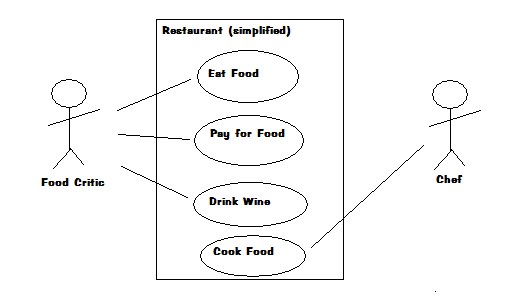

# Dysfunctional DDD


# Jarek

works at Engenius GmbH

Wizard, Anarchitect, Coder

&gt; 25 years of coding<!-- .element class="fragment"-->


# disclaimer
   - I tried not to attack anyone, actually I do have learned a lot from my colleagues doing DDD<!-- .element class="fragment"-->
   - not an expert, (some experience wih CQRS/ES not DDD)<!-- .element class="fragment"-->


# Why DDD?
- People talk about it
- a piece Object oriented world
- that is mostly ignored in FP
- I like mixing concepts 


My problem with DDD


DDD story resembles me 
- UML
- what happened to  Agile


<!-- .element height="400px"-->

some cool diagrams<!-- .element class="fragment"-->


<!-- .element height="400px"-->

some WTF diagrams...<!-- .element class="fragment"-->


# Agile good parts
 - Tests, TDD
 - CI,
 - Code over comments
 - contact with user


<!-- .element height="600px"-->


# Agile bad parts
 - boring meetings
 - agile coaches, 
 - certificates
 - agile tools
 - books
 - conferences
 - trainings
 - velocity :-)


 


There is nothing wrong about money.

I work for money!


However,

who likes marketing b...it?! <!--.element class="fragment"-->


For years I was scared of DDD marketing


# Books

<!-- .element height="400px"-->
 <!-- .element height="400px"-->


Make logic of the system visible in code


# DDD good parts
- community - people trying to be better
- constant improvement
- lots of patterns / ideas
- interesting stories


<!-- .element height="400px"-->


## DDD bad(?) parts
- marketing
- partly toxic community
- hard to grasp the point
- crazy example projects
- over-engineering 


If a tool, methodology, framework makes simple case **complex**

it will probably not make a real life, complex project **simpler**


<!-- .element height="450px"-->

ok


<!-- .element height="450px"-->

wat?


## BUT


<!-- .element height="450px"-->

I should think about money too


## DDD is mostly
## not about 
## technology


## Finding common Language

Ubiquitous Language


## Bounded context

One `Product` does not fit everybody


### Divide domain by context
 - customer
 - sales
 - ads
 - booking 
 - supply


Avoid communication traps

`Principle of least astonishment` on design


# Example DDD project


# Lets play snake  (multiplayer)


# Code

[https://github.com/jarekratajski/dysfunctional_ddd](https://github.com/jarekratajski/dysfunctional_ddd)

dsnake - haskell rest server, (yesod)

Work in progress (always)

Please, do not use it as a sensible DDD example resource (yet)

(help needed :-) )


# Event storming


### Domain events


<!--.slide: data-background="img/eventstorm/events.png"-->


<!--.slide: data-background="img/eventstorm/commands.png"-->


<!--.slide: data-background="img/eventstorm/actor1.png"-->


<!--.slide: data-background="img/eventstorm/actor2.png"-->


<!--.slide: data-background="img/eventstorm/snake.png"-->


# Modelling phase 2

- Snake
- SnakeCell
- ...


# Command

 - user or subsystem `wants` to do something
 - commands may be associated with validation


```haskell
data SnakeCommand
   = SetDirection { wantedDirection :: SnakeDirection }
   | MakeStep
   | Begin { 
             initName :: String,
             initCell :: SnakeCell }
```


# Event

 - it has happened
 - no validation (it really happened)
 - a single command can trigger  0..n events 


```haskell
data SnakeEvent
   = DirectionChanged { newDirection :: SnakeDirection }
   | StepMade
   | Killed
   | Born { bornName :: String
          , bornCell :: SnakeCell }
   deriving (Eq, Show, Generic)
```


## We will do CQRS based solution


*Fact*

You will not find anything about CQRS  in Eric Evans book  (blue))
 
Even though nowadays  DDD community seems to be all around those concepts 


# DDD building blocks


# Value Object

- immutable...
- represents value (from `real` life)
- has no identity
- properties define equality


```haskell
type SnekeId = String

type NickName  = Text

data SnakeDirection
   = SnakeUp
   | SnakeRight
   | SnakeDown
   | SnakeLeft   
```


# Entity

- has identity
- in OOP may be mutable
- ID/key defines equality 
- entity may contain `value objects`
- entity may contain `entities`


```haskell
data SnakeCell = SnakeCell
   { cellX :: Int
   , cellY :: Int
   } 

data SnakeState
   = Alive { direction :: SnakeDirection
           , cells     :: [SnakeCell]
           , maxLength :: Int }
   | Dead
   | Init
   
data Snake = Snake
   { name  :: String
   , state :: SnakeState
   } deriving (Eq, Show, Generic)

type SnakeEntity = (SnakeId, Snake)
```


Easy?


`SnakeCell(x,y)`
 
is it value object or entity? <!--.element class="fragment"-->


*To think*

I have never introduced `type SnakeEntity = (SnakeId, Snake)` 

SnakeState  does not (physically) contain Id

an Entity without id??<!-- .element class="fragment"-->

but we reference Snake by SnakeId <!-- <!--.element class="fragment"-->


## Lesson

Some DDD concepts may not explicitly exist in code
 
`(SnakeId, Snake)`


It gets worse


## Aggregate


Cluster of objects (entities, value objects, + ) 


Aggregate remains consistent

Keeps invariants <!--.element class="fragment"-->


Transactions should not cross aggregates


### Aggregate root

- Selected entity from Aggregate (root)
- outside world only keeps reference to this `root object`  
- outside world communicates with it (sends commands)
- command handler
- event handler


```haskell
class Aggregate s where
    data Error s :: *
    data Command s :: *
    data Event s :: *

    execute :: s -> Command s -> Either (Error s) (Event s)
    apply :: s -> Event s -> s
    seed :: s
```
Typeclass
source: https://gist.github.com/Fristi/7327904


## Command handler

```haskell
executeCommand :: Snake -> SnakeCommand -> [SnakeEvent]
```


## Better command handler
```haskell
executeCommand :: Snake -> SnakeCommand
      -> Either MyError [SnakeEvent]
```


## Event handler
```haskell
applyEvent::Snake-> SnakeEvent -> Snake
```


###  DDD CQRS Style
- define commands
- define events
- select root Entity
- define commands handler
- define events handler


```haskell
executeCommand :: SnakeData -> SnakeCommand -> [SnakeEvent]
executeCommand SnakeData {state = Alive {}} MakeStep = [StepMade]
executeCommand _ MakeStep = []
executeCommand SnakeData {state = Alive {direction = od}} SetDirection {wantedDirection = nd}
   | opposite = []
   | otherwise = [DirectionChanged {newDirection = nd}]
  where
    opposite = V.dirIs0 $ V.dirPlus newVec currentVec
    newVec = V.dirVector nd
    currentVec = V.dirVector od
executeCommand anySnake SetDirection {} = []
executeCommand SnakeData {state = Alive {}} Die = [Killed]
executeCommand _ Die = []
executeCommand SnakeData {state = Init} Begin {initName = d, initCell = c} = [Born {bornName = d, bornCell = c}]
executeCommand _ Begin {} = []
-- executeCommand snake@SnakeData{ state = alive@Alive{}} Eat {}= []
executeCommand _ Eat{} = []
```

Real Command handler


```haskell
applyEvent snake@(SnakeData {state = alive@Alive {}}) DirectionChanged { newDirection = nd }  =
      makeRes $ snake { state = alive{direction = nd} }
applyEvent snake@(SnakeData {state = Alive {}}) Killed = makeRes snake { state = Dead}
applyEvent SnakeData {state = Init} Born {bornName = nm, bornCell = cell} = SnakeEventResult {
            newSnake = SnakeData { name = nm , state = initialState },
               newCells = [cell], removedCells = []
      }
   where initialState = Alive { direction = SnakeUp, cells = [cell], maxLength = 5 }
applyEvent snake@(SnakeData {state = alive@Alive {maxLength = n}})  HasEaten{} =
         makeRes snake { state = alive { maxLength = n+3} }
applyEvent _ _ = error "todo"

```

Real event handler


**behaviour first** / **verbs first** seem to be quite efficient

even in OOP/OOM <!--.element class="fragment"-->


Whole system as an aggregate? 
 
 (One Big Aggregate)


# Repository


Remember DAO?


Magic...


- loadEntity::Id->IO Entity
- saveEntity::Id->Entity->IO ()  
- etc...


## Fact

Lots of magic Java frameworks trace state of objects
and automatically persist changes to database

This means that a sensible repository `save` method may look  like:


Valid implementation of save from one of java projects

```java
   void save(MyObject t) {
    
   }
```


But what in case of event sourcing?


```haskell
data SnakeAggregate = SnakeAggregate { 
      state :: SnakeState,
      uncommittedEvents :: [SnakeEvent]
}       
```

Common pattern in DDD style event sourcing 

is to save those `uncommited events`


I find it unnatural


I started to send commands to a *Repository*


```haskell

applyCommand :: SnakesRepo-> SnakeId -> Snake.SnakeCommand
   -> IO SnakesRepo

```
That is so unDDD<!-- .element class="fragment"-->

Maybe we  need better name for this pattern<!--.element class="fragment"-->

Maybe it exists already <!--.element class="fragment"-->


# CQS

Command Query separation


If you ask (Query) do not change the state


If You change state (Command) do not expect result


A  non CQS Stack

```java
void stack.push( T  t);
T  stack.pop();
```


A CQS Stack

```java
void stack.push( T  t);
T stack.top();
void stack.pop();
```


Simple?


what if called on an empty stack?
```
void stack.pop();  // boom
```


OO world consensus:

commands may return exceptions, some status, etc.


Is an `error` not a result?


In FP world


```haskell
push::Stack a->a->Stack a
top::Stack a->Maybe a
pop::Stack a->Stack a
```


In FP world each operation gives a result


IO ()


```haskell
uberPop::Stack a->(Stack a, a)
```

Is it really that bad?


Actually I do not see much sense in classical CQS (in FP)

 - nice to have separated queries
 - Error/Exception **is** an result
 - It only makes API easier to use ... in some mediocre languages
 -  `async`?


 ```
 push::Stack a -> MonadAsync (Stack a)
```


 # CQRS
 
Command Query Response Segregation


CQRS   ~ CQS on a higher level


Write/Command model - Aggregates


Read/Query model - Projections


Some CQRS principles
- Critica rulel: Events handler cannot use any external data (projection)
- Rule: You can always recreate Aggregates using Events
- Rule: You can always recreate multiple projections using Events


*Fact*

In `less pure` languages it is easy to make a mistake

```scala
def eventHandler(state : State, event : Event) : State { 
  LocalDate.now()
  val x =  someRandom.nextInt()
  ...
}
```


## DDD Lessons


Try to minimize impact of technical details in your code  

```java
Mono<User> user = repo.findUser(1001);
Mono<Group> group = user.flatMap (user -> user.getGroup())
Mono<NotificationChannel> channel = 
    group.map ( group -> group.getNotificationChannel())    

``` 
<!--.element class="fragment"-->

Which is hard in Java <!--.element class="fragment"-->


```scala
for {
  user <- repo.findUser(1001)
  group <- user.getGroup()
  
} yield ( group.notificationChannel)
```


Popular FP languages have great power to hide technical details


## With great power....

comes Monoid, Profunctor and Apomorphism <!--.element class="fragment"-->


Abstractions are great

But they should not overshadow the business logic


Yet,

Code is for coders <!--.element class="fragment"-->

Do not fight to make it readable  by  business! <!--.element class="fragment"-->

This is not the goal <!--.element class="fragment"-->


### The goal is to make the next developer communication with business easier


This is hard    

This is craft <!--.element class="fragment"-->

This is an art <!--.element class="fragment"-->


There is no golden hammer


### Resources on DDD/CQRS
 
Eric Evans  `Domain Driven Desing`

Vaughn Vernon `Implementing Domain-Driven Design` 
 
 `http://CQRS.nu` (FAQ) page
 
 `https://github.com/ddd-by-examples/event-source-cqrs-sample` by Kuba Nabrdalik
 
 `https://github.com/vlingo` vlingo platform  


### Conclusion

DDD will not magically solve your problems <!--.element class="fragment"-->

It is about  learning how to make business logic visible in code <!--.element class="fragment"-->

Not all DDD pattern apply in FP  <!--.element class="fragment"-->

But our languages are actually sometimes more expressive <!--.element class="fragment"-->

And this is yet another chance to make FP business friendly <!--.element class="fragment"-->

`@jarek000000`
