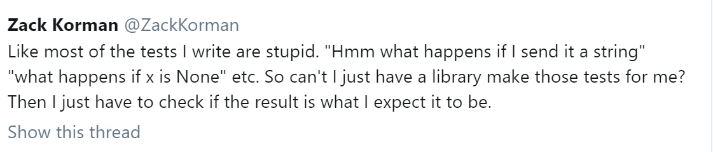
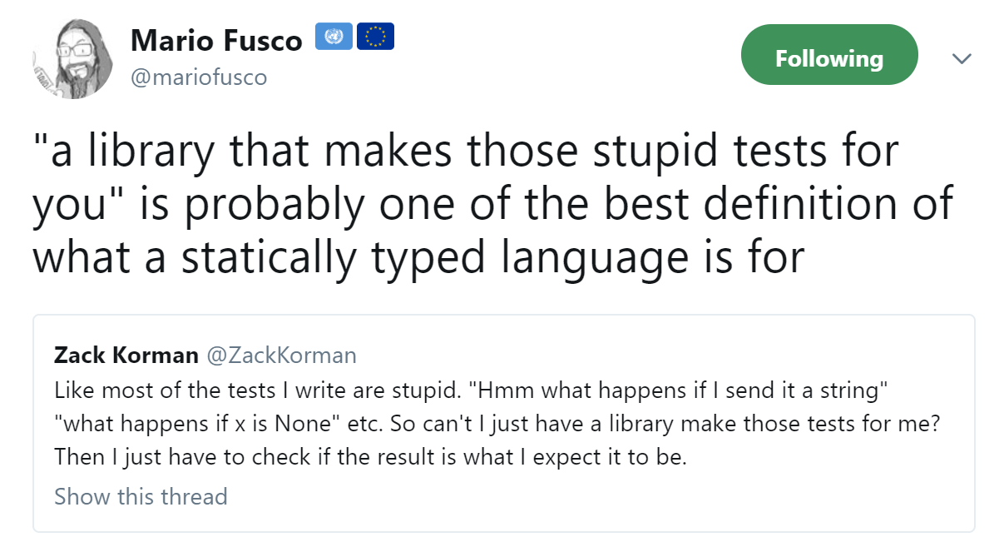

# Pure server


# Jarek

Wizard, Anarchitect, Coder

&gt; 25 years of coding<!-- .element class="fragment"-->


## Rest server

```
GET /products/137/details HTTP1/1

Accept: application/json
``` 

Request


```
HTTP/1.1 200 OK
Content-Type: application/json

{
 "name" : "skarpety dziurawe",
 "size": "xxl",
 "color" : "pink"
}
```

Response


## How do  we do rest server?


Easy way

```
nc -l 80
```

- add loadbalancer <!--.element class="fragment"-->
- add 100 fast typists  <!--.element class="fragment"-->


## Hard way

Code the program that listens on port (80 by default)


## Languages 1

- JavaScript (node)
- PHP
- Python
- bash


## Getting things  done fast

Scripting, interpreted,  dynamically typed


## Problems ? 

- errors on production <!--.element class="fragment"-->
- long term maintenance <!--.element class="fragment"-->
- refactoring <!--.element class="fragment"-->


## Languages 

- Java/C#
- Kotlin
- C++
- TypeScript
- Scala


## Slower, more stable

Static compilation


## Problems

- errors on production <!--.element class="fragment"-->
- long term maintenance <!--.element class="fragment"-->
- but less than before <!--.element class="fragment"-->


## Tests

Help in dynamic languages and in static languages








More powerful type system `->` less tests 


<!-- .slide: data-background="img/pure/purity.jpg"-->
## What is pure ?


## What is impure ?


```
interface ValueableItem {
   double getPrice();
}

```


<!-- .element height="400"-->

Using `double` for `money`


```java
interface ValueableItem {
   BigDecimal getPrice();
}

```


```java
interface ValueableItem {
   MonetaryAmount getPrice(int itemNo);
}

```


```java
class MyPrecious implements ValueableItem {
 public BigDecimal getPrice(int itemNo) {
   return new BigDecimal(itemNo*10);
 }
}
```


What if


```java
class MyPrecious implements ValueableItem {
 public BigDecimal getPrice() {
   return new BigDecimal(LocalDate.now().getMonthValue()*15
    +itemNo);
 }
}
```


## Impurity problems

- non repeatable tests
- exceptions
- hidden io
- hard to spot dependencies (global values etc.)
- concurrency problems
- surprises on production


## Rescue


# Purely functional programming


Functional programming `==` programming **with** side effects

 <!--.element class="fragment" height="400"-->
 


Functional programming `==` programming **with explicit** side effects


```haskell
valuableItem::Int->MonetaryValue

valuableItem a = a*2
```


```haskell
valuableItem::Int->MonetaryValue
valuableItem a = getCurrentTime*3
```

Compiler error. Expected `MonetaryValue`. 

Have  `(IO MonetaryValue)`


Other effects

```
valuableItem::Int->IO MonetaryValue

valuableItem::Int->Maybe MonetaryValue

valuableItem::Int->Db MonetaryValue

valuableItem::Int->DbTransaction MonetaryValue

valuableItem::Int->IOTime MonetaryValue

valuableItem::Int->Future MonetaryValue

valuableItem::Int->Future (Maybe MonetaryValue)
```


## A Monad

>  a monad in X is just a monoid in the category of endofunctors of X, with product × replaced by composition of endofunctors and unit set by the identity endofunctor.


## A monad

A container on steroids
Can be used to declare a side effect


# Haskell basics


Datatype definition

```haskell
data SnakeCell = SnakeCell
   { cellX :: Int
   , cellY :: Int
   } deriving (Show, Eq, Generic, Ord)
```


Function definition

```haskell
cellToText :: SnakeCell -> String
cellToText c = "cell_" ++ show (cellX c) ++ "_" ++ show (cellY c)
```


There is more


# Tools

- GHC
- Hackage
- Cabal
- Stack


https://github.com/jarekratajski/dysfunctional_ddd/tree/master/dsnake

```
stack setup
stack run
```


## Yesod

One of many server libraries for haskell


https://www.yesodweb.com/book/basics


Simple html page  with yesod

```haskell
{-# LANGUAGE OverloadedStrings     #-}
{-# LANGUAGE QuasiQuotes           #-}
{-# LANGUAGE TemplateHaskell       #-}
{-# LANGUAGE TypeFamilies          #-}
import           Yesod

data HelloWorld = HelloWorld

mkYesod "HelloWorld" [parseRoutes|
/ HomeR GET
|]

instance Yesod HelloWorld

getHomeR :: Handler Html
getHomeR = defaultLayout [whamlet|Hello World!|]

main :: IO ()
main = warp 3000 HelloWorld
```


## More realistic example


## a snake demo


Declare `GET`s & `POST`s 

```haskell
mkYesod "Game" [parseRoutes|
[...]
/snakes/#Text/dir  ChangeDirR POST
/snakes SnakesR GET
[...]
|]
```


Get example

```haskell
getSnakesR :: Handler Value
getSnakesR = do
   gameRef <- getYesod
   snakes <- liftIO $ getSnakes gameRef
   returnJson $ snakes
```


What is a `Game`

```haskell
data Game = Game
   { snakeRepo :: Repo.SnakesRepository
   , plane     :: Plane.Plane
   }
   
type SnakesRepository = IORef SnakeRepoState   

```
`IORef` ==  Variable, mutable value


Yes, we mutate in haskell

But the result will be under IO monad<!--.element class="fragment"-->


Querying game

```haskell
getSnakes :: Game -> IO [Snake.SnakeData]
getSnakes game = query game (\g -> Repo.findAll $ Repo.repo g)

query :: ToJSON a => Game -> (Repo.SnakeRepoState -> a) -> IO a
query game f = fmap f (readIORef aSnakeRepo)
  where
    aSnakeRepo = snakeRepo game
```


POST example

```haskell
postChangeDirR :: Text -> Handler Value
postChangeDirR aSnake = do
      direction <- requireJsonBody :: Handler SetDirection
      gameRef <- getYesod
      registered <- liftIO $ changeDirection gameRef snakeId ( dir direction )
      liftIO $ putStrLn $ "snakeID= " ++ snakeId ++ "]"
      returnJson $ dir direction
   where
      snakeId = unpack aSnake

```


Service function

```haskell
changeDirection :: Game -> String -> Snake.SnakeDirection 
   -> IO Game
changeDirection game snakeId direction = do
   let cmd = Snake.SetDirection {Snake.wantedDirection = direction}
   performCommand game snakeId cmd
```


Command executor

```haskell
performCommand :: Game -> String -> Snake.SnakeCommand -> IO Game
performCommand game uidString cmd = do
   _ <- Repo.executeCommand aSnakeRepo uidString cmd
   return game
  where
    aSnakeRepo = snakeRepo game

```


Command handler

```haskell
executeCommand :: SnakeData -> SnakeCommand -> [SnakeEvent]
[...]
executeCommand SnakeData {state = Alive {direction = od}} SetDirection {wantedDirection = nd}
   | isOpposite = []
   | otherwise = [DirectionChanged {newDirection = nd}]
  where
    isOpposite = V.dirIs0 $ V.dirPlus newVec currentVec
    newVec = V.dirVector nd
    currentVec = V.dirVector od
executeCommand _ SetDirection {} = []
[...]
```


Event handler

```haskell
applyEvent::SnakeData -> SnakeEvent -> SnakeData
applyEvent snake@(SnakeData {state = alive@Alive {}}) DirectionChanged { newDirection = nd }  =
      makeRes $ snake { state = alive{direction = nd} }
```


CQRS /Event sourcing

- We store events
- Event is a fact that happened
- Command is something a user wanted, 
      result of command is a Sequence of events


## Events sourcing
 - fits well with DDD,
 - makes testing easier,
 - scalable design,
 - complex for beginners
 


Classical DB is also possible

```
import Database.PostgreSQL.Simple

mport Database.PostgreSQL.Simple

hello :: IO Int
hello = do
  conn <- connectPostgreSQL ""
  [Only i] <- query_ conn "select 2 + 2"
  return i
  
``` 


#  back to mainstream


# Classical Java/Spring

- Mainstream 
- Runtime reflection
- Runtime aspects
- Slow cimpliation/build/startup (classpath scan) 
- Slow, unreliable testing
- Problems on production


`Spring` combines problems of Statically and dynamically typed languages 


But is is well tested, stable

> 100 Billion of Flies Can't Be Wrong


## Spring WebFlux/ Java Kotlin

- no classpath scan (faster)
- functional approach
- no runtime aspects and reflection (if you do not use `classical parts` of Spring)
- less mainstream but it still Spring
- pure fp potentially possible, with discipline, lack of libraries (VAVR, Arrow-Kt) 


## Scala  Akka-HTTP

- functional
- very, very slow compilation
- very fast start
- no runtime magic
- powerful type system
- effects (libraries), ZIO, ScalaZ,Cats-effect
- currently most mainstream pure fp
- still You can do `any impure evil` that you want


## Eta

- haskell on JVM
- not ready for production yet


 ## World is changing
 
- when I started studying mainstream was `C`
- as I studied OO exploded `C++` becaome mainstream
- my first full time job was `Java`  `	¯\_(ツ)_/¯`


# Thank you

- purely functional may be next mainstream <!--.element class="fragment"-->
- may be not <!--.element class="fragment"-->
- give it a try <!--.element class="fragment"-->

